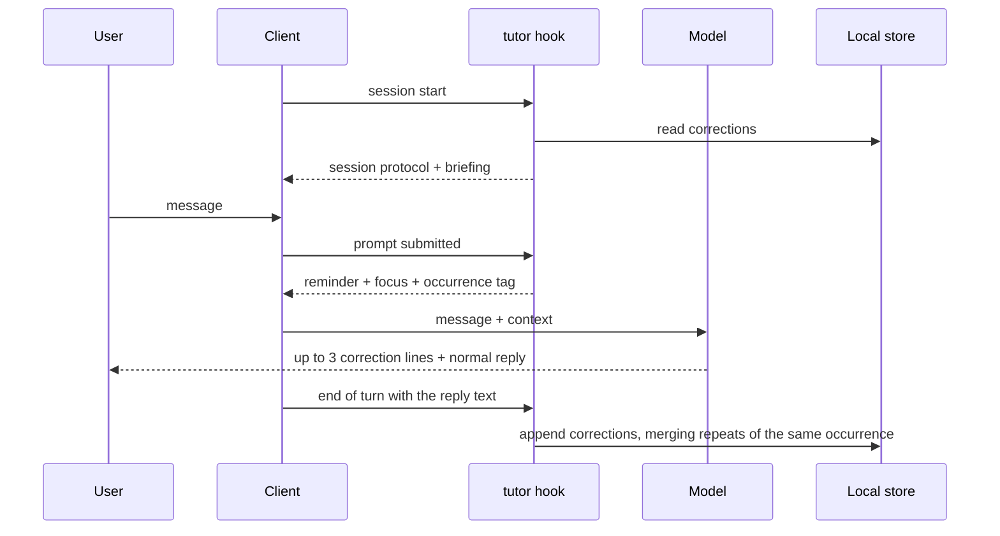

# architecture.md: current architecture

This file is the single source of the current architecture: layers, modes, repository layout, packaging, the `tutor` CLI, the hooks, capture, storage, preferences, the context budget and the test strategy. It describes the code of release `0.2.0`. Why the architecture looks this way is in `docs/adr/README.md`, what the product promises is in `docs/product.md`, and verified client behavior is in `docs/compatibility.md`. The correction protocol text and the mistake categories live in `plugin/skills/english-tutor/references/`, and this file links to them instead of copying them.


Diagram sources: [`diagrams/english-tutor-architecture-en.html`](diagrams/english-tutor-architecture-en.html) and `.svg`.

## Layers

[ADR-0001](adr/0001-tutor-layers.md) splits the tutor in two layers.

1. **Portable core**, the Agent Plugins package in `plugin/`: the `english-tutor` skill, the `english-tutor` MCP server and the bundled `tutor` CLI that the server runs. The correction protocol, the pt-BR profile, storage, the briefing and the reports live here.
2. **Trigger adapters**, one per client. Each one calls `tutor hook <client> <event>` and only translates that client's input and output. `src/hooks/claude-code.ts` and `src/hooks/codex.ts` normalize the payloads, `src/hooks/runner.ts` runs the behavior against the core, and `src/hooks/output.ts` formats the reply for the client. No pedagogy lives in the hooks.

## Modes

What each mode gives the user is in `docs/product.md`. The implementation plan and `docs/compatibility.md` use the pt-BR names in parentheses.

| Mode | What the client must offer |
|-|-|
| Complete (Completo) | a per-message hook that injects context, plus MCP and skills |
| Standard (Padrão) | MCP and skills, without a per-message hook |
| Minimal (Mínimo) | skills only |

| Client | Package | Mode |
|-|-|-|
| Claude Code | `plugin/` through `.claude-plugin/marketplace.json` | Complete |
| Codex | `adapters/codex/` through `.agents/plugins/marketplace.json` (D12), after the hook trust review | Complete |
| Codex | `plugin/` alone | Standard |

Flow in Complete mode:



## Repository layout

```text
english-tutor-claudinho/
  AGENTS.md                          project rules and documentation routing (canonical)
  CLAUDE.md                          imports AGENTS.md
  README.md
  package.json, tsconfig.json, eslint.config.js, vitest.config.ts, .nvmrc
  .claude-plugin/marketplace.json    Claude Code: points to ./plugin with hooks and MCP inline
  .agents/plugins/marketplace.json   Codex: points to ./adapters/codex (D12)
  .github/workflows/ci.yml
  docs/                              routed from AGENTS.md
  src/
    main.ts, cli.ts, commands.ts, version.ts
    core/                            store, privacy guard, model, protocol, stats, briefing, report, preferences, state, paths, references
    mcp/                             server and stdio transport
    hooks/                           client parsers, runner, gates, output formatting
  plugin/                            canonical Agent Plugins 1.0.0 package
    plugin.json, mcp.json, LICENSE, CHANGELOG.md
    skills/english-tutor/            SKILL.md and references/
    dist/tutor.mjs                   committed bundle
  adapters/codex/                    legacy Codex package generated from plugin/, never edited by hand
  scripts/                           build, Codex adapter generation, bundle check, conformance validator
  vendor/agent-plugins/1.0.0/        official spec schemas
  spikes/                            Phase 1 verification tooling, not shipped
  test/
    unit/
    contract/                        hook contract tests; fixtures/<client>/ holds recorded payloads
    mcp/
    fixtures/eslint/                 type-escape samples for the lint ban test
```

Layout rules:

- `plugin/` follows the spec to the letter. A client-specific file goes only into a namespace directory or `extensions` (D3).
- The marketplaces stay outside the package, because the spec's migration guide classifies marketplaces as distribution metadata.
- `plugin/dist/` and `adapters/codex/` are build output. `npm run check:bundle` and `npm run check:codex-adapter` keep them in sync with the sources.

## Packaging

The manifests are the source of their own content. This section says what each one is for.

| File | Role |
|-|-|
| `plugin/plugin.json` | Agent Plugins manifest, pinned to the 1.0.0 schema, with no hooks |
| `plugin/mcp.json` | Agent Plugins MCP declaration: `node ${PLUGIN_ROOT}/dist/tutor.mjs mcp` over stdio |
| `.claude-plugin/marketplace.json` | Claude Code entry with `strict: false` that declares the skills, the MCP server (`${CLAUDE_PLUGIN_ROOT}`) and the three hooks inline, because Claude Code does not read the Agent Plugins `mcp.json` (S1) |
| `adapters/codex/.codex-plugin/plugin.json` | legacy Codex manifest, because Codex never loads hooks from Agent Plugins packages (S2, D12) |
| `adapters/codex/.mcp.json` | launches `node dist/tutor.mjs mcp` with `cwd: "."`, because the legacy loader roots a relative `cwd` at the installed plugin and leaves `${PLUGIN_ROOT}` in `args` unexpanded (S6, fixed in 0.2.0) |
| `adapters/codex/hooks/hooks.json` | the three Codex hooks as shell commands with `timeout: 30` |
| `.agents/plugins/marketplace.json` | Codex marketplace that points to `adapters/codex/` |

## CLI and hook rules

The MCP server and the hooks run the same bundle, `plugin/dist/tutor.mjs`. CI starts it on Node.js 22 and 24, on Linux and Windows.

| Command | Use |
|-|-|
| `tutor mcp` | MCP server over stdio |
| `tutor hook <client> <event>` | reads the payload on stdin and replies in the client's format; clients `claude-code` and `codex`, events `session-start`, `user-prompt-submit` and `stop` |
| `tutor report [--period day\|week\|all]` | Markdown practice log, `all` by default |
| `tutor config get [key]` and `tutor config set <key> <value>` | preferences |
| `tutor purge --yes [--all \| --from D --to D]` | erases every record, or the records in a date range |
| `tutor doctor` | prints the Node.js version, the store directory and its origin, and the references directory |
| `tutor help` and `tutor version` | usage and version |

Hook rules:

- A hook never breaks a session. An unknown client or event, an unreachable store, a payload that does not parse or any internal error ends with exit 0 and the client's empty output. Internal errors are logged to `<store>/logs/hooks.log`.
- A hook never blocks a prompt or a tool call and never uses the network.
- Synchronous hooks have a p95 budget below 300 ms, not measured yet (`docs/tasks.md`).
- The reminder goes out once per turn, even when two hook declarations fire: a marker created with an exclusive write in `<store>/state/` claims the turn, and markers expire after one hour.
- `ENGLISH_TUTOR_DISABLE=1`, an active `paused_until` and a `disabled_projects` entry that contains the working directory silence every hook.

## Correction protocol

The protocol text and its rules live in [`references/correction-protocol.md`](../plugin/skills/english-tutor/references/correction-protocol.md). The mechanism around that text:

- **Session start.** The hook injects `SESSION_PROTOCOL` from `src/core/protocol.ts`, a five-line operational form of the protocol, followed by the briefing when the `briefing` preference is on. The runner skips a session start with `source: resume`, because Claude Code replays `SessionStart` on resume and the protocol is already in the transcript. Every other session start, a compaction included, gets the protocol again.
- **Full text.** The reference text reaches the model through the skill, the `english-tutor://protocol` resource and the `english-tutor-on` prompt. The hook does not inject it.
- **Per message.** The hook injects one reminder line that names up to three focus categories from the recorded history, followed by an `[occ:<id>]` occurrence tag. Context injected by a hook stays in the transcript, which is why the per-message part is a reminder and not the protocol.
- **Output.** At most 3 lines in the form `✏️ [category] "original" → "correction" (short reason)`, at the top of the final reply. The end-of-turn capture parses the marker and the category ID.

## pt-BR profile

The categories, with stable IDs and examples, live in [`references/l1-pt-br.md`](../plugin/skills/english-tutor/references/l1-pt-br.md). `src/core/model.ts` holds the same IDs as a closed enum, with a focus phrase for each one. The statistics group on these IDs, so an ID is never renamed once mistakes are recorded against it.

The enum, the `english-tutor://profile/pt-BR` resource and the reference names that `src/core/references.ts` accepts are fixed to pt-BR, so another native-language profile needs code changes as well as a new reference file.

## MCP surface

`src/mcp/server.ts` registers:

| Tool | Input | Effect |
|-|-|-|
| `record_corrections` | a list of `{original, correction, category, reason}`, each with an optional `occurrence_id`, and an optional `client` (default `mcp`) | stores each correction with `source: tool`, merges a repeat of the same occurrence and mistake, and reports how many items were recorded, merged and skipped |
| `get_briefing` | optional `limit` from 1 to 20 (default 3) | main weaknesses, 7-day trend and suggested focus |
| `get_report` | optional `period`: `day`, `week` or `all` (default) | Markdown practice log |
| `set_preferences` | any subset of the preferences | validates, merges and stores them |
| `purge_history` | `confirm: true`, plus `all: true` or a `from`/`to` date range | erases records |

- Prompts, which clients that expose MCP prompts show as commands: `english-tutor-on` sends the full protocol, `english-review` the briefing and `english-report` the full log.
- Resources: `english-tutor://protocol`, `english-tutor://profile/pt-BR` and `english-tutor://report`. The first two read the skill references at runtime, so the skill stays the single source of the pedagogy.
- `instructions`: a short description of the tools and resources. It does not pick a mode from `clientInfo.name`, because the client name does not tell whether a hook is present, trusted or enabled. Whether a model sees the text depends on the client and the model (S3).

## Hooks per client

| Client | Session start | Per message | End of turn | Declared in | Output |
|-|-|-|-|-|-|
| Claude Code | `SessionStart` | `UserPromptSubmit` | `Stop` with `last_assistant_message`, `async: true` | `.claude-plugin/marketplace.json` | plain text on stdout |
| Codex | `SessionStart` | `UserPromptSubmit` | `Stop` with `last_assistant_message`, declared without `async` and with `timeout: 30` | `adapters/codex/hooks/hooks.json` (D12) | `hookSpecificOutput.additionalContext` JSON for `SessionStart` and `UserPromptSubmit`, because Codex 0.154.0 parses stdout that starts with `[` as JSON (S6, fixed in 0.2.0) |

The turn identifier comes from `prompt_id` on Claude Code and from `turn_id` on Codex, with the session ID as the fallback. Codex runs these hooks only after the user trusts them, and `codex exec` skips untrusted hooks without a warning (`docs/compatibility.md`).

## Capture

1. Where the end-of-turn payload carries the reply text, the `Stop` hook parses the `✏️` lines of the final reply, without spending model tokens. Lines that do not parse, or whose category or fragments break the store rules, are dropped.
2. Where no such hook runs, the skill and the MCP `instructions` ask the model to call `record_corrections`.
3. The occurrence ID is the first 16 hex characters of a SHA-256 over client, session and turn. The per-message reminder carries it as `[occ:<id>]`, the model passes it back to `record_corrections`, and the `Stop` capture derives the same value, so both paths agree.
4. The store merges a record whose occurrence ID and mistake key match an existing record. A repetition in another turn or session is a new occurrence and is kept.
5. Without an occurrence ID, every `record_corrections` call is a new occurrence, so a matching `original` and `correction` never suppress a later correction.
6. The end-of-turn capture is best effort. On Claude Code it runs asynchronously, and a client that exits first can lose the last occurrence.

## Storage and privacy

The store is one directory per OS user (D4), resolved in `src/core/paths.ts` in this order:

1. `ENGLISH_TUTOR_DATA`, when set, for tests and locked-down setups.
2. `~/.english-tutor-claudinho/`, from the OS user API (`os.userInfo().homedir`), when it is writable. Spec §9.1 forbids a server from depending on base environment variables, and the OS user API avoids that dependency.
3. `$PLUGIN_DATA/english-tutor-claudinho/` otherwise, for example inside a sandbox. A client may delete this directory on uninstall, so this fallback does not keep the history after an uninstall.

One directory serves every client, so Claude Code and Codex share the history.

| File | Content |
|-|-|
| `corrections.jsonl` | source of truth, append-only: one event per correction with `id`, `occurrence_id`, `mistake_key`, `ts`, `client`, `category`, `original`, `correction`, `reason` and `source` (`hook` or `tool`) |
| `stats.json` | derived: total, patterns grouped by mistake key, counts per category, and the last and previous 7 days |
| `english-practice-log.md` | derived: the `all` report, with Pattern Tracking and Daily Log |
| `config.json` | preferences |
| `state/` | once-per-turn markers, expiring after one hour |
| `logs/hooks.log` | hook errors |
| `.lock` | cross-process lock directory |

- Writes go through a lock built on the atomic failure of `mkdir`, retried every 20 ms for up to 3 s. A lock older than 10 s is treated as abandoned.
- The derived files are rebuilt after every append or purge. A failure there never loses the append, because both files can be rebuilt from `corrections.jsonl`.
- A malformed line in `corrections.jsonl` is skipped on read, so one bad append never hides the rest of the history.
- Only the incorrect fragment and its correction are stored, each at most 160 characters and 24 words. `src/core/privacy.ts` is the final guard at the storage boundary, where hook and MCP input is still untrusted: it rejects line breaks, secret-shaped values, code, commands, logs, stack traces, file paths, URLs and prompt-shaped text. zod validates every stored value, and the stored `mistake_key` must match its fragments.
- No network access and no telemetry.

## Preferences

Preferences live in `config.json`, are validated with zod and change through `tutor config set` or the `set_preferences` tool. A missing or invalid file yields the defaults.

| Preference | Values | Default | Read by |
|-|-|-|-|
| `strictness` | `essential`, `standard`, `strict` | `standard` | no component |
| `explanation_language` | `en`, `pt-BR`, `en-with-pt-notes` | `en-with-pt-notes` (D5) | no component |
| `portuguese_messages` | `ignore`, `hint` | `ignore` (D6) | no component |
| `placement` | `top`, `bottom` | `top` | no component |
| `briefing` | `on`, `off` | `on` | the session-start hook |
| `paused_until` | ISO date-time; an empty string clears it | unset | the hook gates |
| `disabled_projects` | list of paths | empty | the hook gates |

No component reads the four preferences marked "no component". The session protocol is a fixed text that asks for English explanations, pt-BR notes for false friends and corrections at the top, and neither the hooks nor the MCP prompts pass preference values to the model. The `hint` mode that the protocol reference describes therefore has no effect. `docs/tasks.md` lists this as an open question.

`disabled_projects` serves work repositories where the conversation with the agent is shared.

## Context budget

| Item | Ceiling | State |
|-|-|-|
| Protocol and briefing at session start | 350 token-equivalents, counted as 1,400 UTF-8 bytes at 4 bytes each | enforced in `src/core/briefing.ts` and tested |
| Per-message reminder | 40 token-equivalents | not enforced; with three focus phrases and the occurrence tag it measures 50 to 53 |
| Corrections shown | 3 lines, only when there is a mistake | protocol rule |
| Capture through the hook | 0 model tokens | by design |
| Capture through the MCP tool | 1 call per message with mistakes | MCP `instructions` |
| Synchronous hook latency | p95 below 300 ms | not measured |

Counting UTF-8 bytes instead of string length keeps multi-byte text inside the same ceiling, and the briefing is cut without splitting a character.

## Test strategy

`npm run check` runs lint, typecheck, the tests, the plugin conformance validator and the freshness checks of the bundle and of the Codex adapter. CI runs it on every push to `main` and on every pull request.

| Level | What it covers | Where |
|-|-|-|
| Unit | store and merge, privacy guard, model, marker parser and occurrence ID, statistics and the briefing ceiling, preferences, state markers, gates, report, CLI and commands, hook output, committed bundle, Codex adapter generation, lint bans | `test/unit/` |
| Contract | recorded payloads of each client and event against the expected output, including a payload that does not parse and the kill switch | `test/contract/` |
| Conformance | manifest and `mcp.json` against the vendored schemas, reverse-domain extension keys, client files only in namespace directories, a single-token MCP command, Agent Skills frontmatter, path containment | `npm run validate:plugin`, `test/unit/plugin-package.test.ts` |
| MCP | the SDK client against `dist/tutor.mjs` over stdio | `test/mcp/` |
| Client validator | `claude plugin validate` | by hand, locally and at release |
| End to end | evaluation runner with real models | not built (`docs/tasks.md`) |

Failure cases covered by tests: a hook payload that does not parse, an unknown client, a corrupt `config.json`, an unknown category and an over-long fragment. The strategy recorded in the implementation plan also listed a corrupt store, a store directory without write permission and a missing Node.js; `docs/tasks.md` lists those gaps as an open question.
