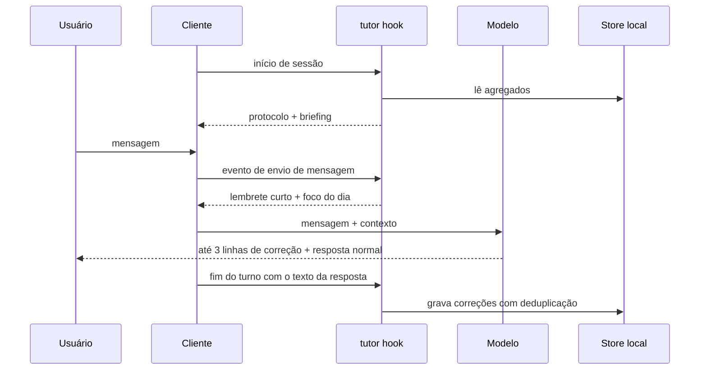

# Plano de implementação: english-tutor-claudinho

- Status: decisões D1 a D11 tomadas em 2026-09-13 (seção 8); Fases 0 e 1 concluídas em 2026-09-13; D12 tomada em 2026-09-13
- Data: 2026-09-13
- Base normativa: [Agent Plugins Specification 1.0.0](https://agent-plugins.org/specification), [Agent Skills](https://agentskills.io/specification), [Model Context Protocol](https://modelcontextprotocol.io/specification)

## 0. Resumo

- O tutor precisa ser acionado a cada mensagem do usuário. Na solução da Luna, quem faz isso são os hooks do Claude Code.
- A Agent Plugins 1.0.0 define como empacotar componentes. Ela padroniza somente Agent Skills e servidores MCP. Hooks, comandos, agentes e regras ficaram fora da v1 por decisão registrada na própria spec, e só podem existir como extensões de cliente em namespace reverse-domain.
- Conclusão: o produto vive no núcleo portátil (skill, servidor MCP e a CLI empacotada que ele executa). O gatilho por mensagem vive numa camada fina de adaptadores de hooks, um por cliente, sem nenhuma lógica pedagógica.
- Onde o cliente não oferece hook capaz de injetar contexto por mensagem, o tutor opera em modo degradado: ativação por sessão e gravação via ferramenta MCP.
- Em 2026-09-13 o Claude Code não implementa Agent Plugins. Ele consome o pacote canônico por um marketplace na raiz do repositório, que declara hooks e MCP inline e deixa o pacote intacto.
- O Codex carrega skills e MCP do pacote canônico e ignora hooks de pacotes Agent Plugins (Fase 1). Para ter o gatilho por mensagem, ele instala um pacote legado gerado a partir do canônico, fora de `plugin/` (D12).
- O MVP atende Claude Code e Codex (D1). Copilot CLI, VS Code e Antigravity CLI (agy) ficam para depois; no teste local, o agy aceitou `plugin.json` e `skills/` e ignorou `mcp.json` e hooks em namespace.
- Várias linhas da matriz de clientes vêm só da documentação. A Fase 1 roda spikes para confirmar cada uma antes de escrever o núcleo.

## 1. Objetivo e escopo

O About do repositório define o objetivo: transformar a ferramenta de código num tutor de inglês usando um padrão neutro de fornecedor.

| Aspecto | Luna (referência) | Este projeto |
|-|-|-|
| Falante | coreana | brasileiro (pt-BR) |
| Cliente | Claude Code | Claude Code e Codex no MVP, demais clientes compatíveis depois |
| Instalação | edição manual de `~/.claude/settings.json` | comando nativo de plugins de cada cliente |
| Formato | configuração solta | pacote Agent Plugins 1.0.0 |
| Histórico | Markdown editado pelo modelo | registro local determinístico e relatório Markdown gerado |

Definição de "plug and play" usada neste plano:

1. Instala com o comando nativo de plugins do cliente ou pelo marketplace dele, sem editar arquivo de configuração à mão.
2. Não exige build na máquina do usuário. O único pré-requisito é Node.js 22 ou superior no PATH.
3. Desinstalar remove todo o comportamento. O histórico no store principal fica até o usuário apagar. Se a CLI precisou usar `${PLUGIN_DATA}` como fallback, o cliente pode apagar esse diretório na desinstalação.
4. Consentimentos exigidos pelo cliente, como a revisão de confiança de hooks no Codex, ficam documentados e fora do nosso controle.

Fora do MVP: interface gráfica, sincronização em nuvem, telemetria, clientes além de Claude Code e Codex e perfis de idioma nativo além do pt-BR.

## 2. O que a solução da Luna faz

Fonte: post de 2026-02-04, lido na íntegra.

1. `UserPromptSubmit` executa `echo` com a instrução: se houver erros de inglês na mensagem, corrigir com uma explicação breve no formato `original -> correction (reason)`, em 1 a 3 linhas. O stdout do hook entra no contexto do modelo, que corrige junto com a resposta normal.
2. Uma versão da mesma instrução pedia ao modelo para anexar a correção em `~/.claude/english-practice-log.md` (tabela Pattern Tracking e seção Daily Log), com a regra de permissão `Edit:~/.claude/english-practice-log.md` para evitar pedidos de aprovação.
3. `SessionStart` com matcher `startup` faz `cat` do log inteiro e pede ao modelo um resumo das fraquezas atuais.

Ela abandonou `SessionEnd`: o hook roda, a sessão termina e o modelo não tem um turno seguinte para escrever o resumo.

O que este projeto preserva:

- A correção acontece dentro da ferramenta já aberta.
- Correções curtas, até 3 linhas.
- O modelo analisa dados brutos, e nenhum passo depende de o usuário lembrar de rodar um comando.

Limitações que este projeto resolve:

| Limitação na referência | Consequência | Resposta neste plano |
|-|-|-|
| Instruções dentro de `~/.claude/settings.json` | só funciona no Claude Code e a instalação é manual | pacote Agent Plugins e adaptadores por cliente |
| Log gravado pelo modelo com a ferramenta de edição | uma chamada de ferramenta por correção, regra de permissão específica do cliente, gravação sujeita a esquecimento do modelo | captura determinística no fim do turno e ferramenta MCP como alternativa |
| A "Full Configuration" final do post não traz a instrução de gravar no log | quem copia só a versão final não acumula histórico novo | gravação independente do texto do prompt |
| `SessionStart` injeta o log completo | o custo em tokens cresce com o histórico, e o Codex desvia para arquivo saídas de hook acima de ~2.500 tokens | agregados calculados pela CLI e briefing com teto |
| Nenhum filtro para código, logs e texto colado | risco de "corrigir" stack traces, identificadores e comandos | regras de exclusão no protocolo e casos negativos na avaliação |
| Perfil de erros coreano (artigos) | não cobre a interferência do português | perfil L1 pt-BR com categorias estáveis |
| `cat` no Linux e `type` no Windows | configuração diferente por sistema operacional | CLI em Node.js com a mesma chamada em todos os sistemas |

## 3. Em qual camada a solução entra

### 3.1 A pilha de um agente de código

| Camada | O que define | Padrão aberto hoje | Papel no tutor |
|-|-|-|-|
| Modelo | gera a resposta | não se aplica | escreve a correção |
| Ciclo de vida do harness | quando algo roda: início de sessão, envio de mensagem, fim de turno | nenhum, cada cliente tem seu sistema de hooks | gatilho por mensagem |
| Pontos de extensão | skills, servidores MCP, hooks, arquivos de instrução | Agent Skills e MCP; hooks e regras são proprietários | conteúdo pedagógico, ferramentas, estado |
| Empacotamento e descoberta | como os componentes chegam ao cliente | Agent Plugins 1.0.0 (skills e MCP) | pacote canônico |
| Distribuição e UX | marketplace, confiança, permissões | nenhum | instalação e consentimento |

A Agent Plugins 1.0.0 atua na camada de empacotamento: diz onde ficam skills e servidores MCP e como o cliente os carrega, sem definir momentos de execução. A seção Design Decisions registra que comandos, hooks, agentes, regras e servidores LSP "remain too client-specific for a stable portable contract". O §8 manda que arquivos específicos de cliente fiquem num diretório de topo com o nome do namespace reverse-domain desse cliente, e dados de manifesto específicos fiquem em `extensions`.

### 3.2 Capacidades necessárias

| # | Capacidade | Pergunta que responde |
|-|-|-|
| C1 | Gatilho por mensagem | Toda mensagem do usuário é avaliada sem ele pedir? |
| C2 | Conteúdo pedagógico | O que corrigir, em que formato e com qual perfil de erros? |
| C3 | Registro | Os erros ficam gravados de forma determinística? |
| C4 | Recuperação | Existe briefing no início da sessão, relatório e revisão? |
| C5 | Distribuição | Instala e desinstala com o comando nativo do cliente? |

### 3.3 Capacidades por camada candidata

| Camada candidata | Portável na Agent Plugins 1.0.0 | C1 | C2 | C3 | C4 | Observação |
|-|-|-|-|-|-|-|
| Arquivos de instrução (`AGENTS.md`, `CLAUDE.md`) | não, regras estão fora da v1 | parcial | sim | não | não | configuração do usuário, fora do pacote; a atenção a instruções do início do contexto cai em sessões longas |
| Agent Skill | sim, em `skills/` | parcial | sim | não | parcial | ativação decidida pelo modelo ou pelo usuário; serve para ligar o modo tutor por sessão |
| Servidor MCP: tools, prompts e resources | sim, em `mcp.json` | não | sim | sim | sim | estado em `${PLUGIN_DATA}`; prompts MCP aparecem como comandos em vários clientes |
| Servidor MCP: campo `instructions` do `initialize` | sim | parcial | sim | não | não | entra em metadados visíveis ao modelo quando o cliente o expõe; a posição e a disponibilidade dependem do modelo e da configuração do cliente |
| Hooks de ciclo de vida | não, só como extensão de cliente | sim | não, por decisão de projeto | sim | sim | único mecanismo determinístico por mensagem; formatos divergem entre clientes |
| Comandos, agentes, output styles | não | não | parcial | não | parcial | dispensáveis, porque prompts MCP e skills cobrem os comandos |

### 3.4 Situação dos clientes em 2026-09-13

A tabela registra a pesquisa anterior aos spikes, inclusive clientes fora do MVP. Os resultados verificados de Claude Code e Codex estão em `docs/compatibility.md` e corrigem a linha do Codex: ele ignora hooks de pacotes Agent Plugins. Evidência: D = documentação oficial, T = teste local nesta máquina, I = issue pública.

| Cliente (versão local) | Carrega Agent Plugins 1.0 | Gatilho por mensagem com injeção de contexto | Onde declarar hooks | Evidência |
|-|-|-|-|-|
| Claude Code 2.1.270 | não: ausente da lista oficial de clientes compatíveis, da referência de plugins e do CHANGELOG | sim: stdout de `UserPromptSubmit` e de `SessionStart` com exit 0 vira contexto; `Stop` recebe `last_assistant_message` | entrada de marketplace com `strict: false` e `hooks`/`mcpServers` inline | D |
| Codex CLI 0.154.0 e ChatGPT | sim | sim: texto em stdout de `UserPromptSubmit` vira developer context; `Stop` recebe `last_assistant_message`; hooks do pacote legado só rodam depois da revisão em `/hooks` | pacote legado `.codex-plugin/plugin.json`; o runtime ignora hooks do pacote canônico | D, T |
| GitHub Copilot CLI 1.0.78 | sim | não: a documentação diz que a saída de hooks de arquivo em `userPromptSubmitted` é descartada; `sessionStart` documenta `additionalContext`, e a issue copilot-cli#2142 relata que ele é ignorado | `com.github.copilot/hooks/hooks.json` | D, I |
| VS Code 1.137 (Copilot Chat) | sim | a confirmar: `UserPromptSubmit` existe, `additionalContext` aparece documentado para `SessionStart`, hooks em Preview | `com.github.copilot/hooks/hooks.json` | D |
| Antigravity CLI (agy) 1.1.27 | parcial: `agy plugin validate` aceitou `plugin.json` e `skills/` e não detectou `mcp.json` nem hooks em namespace | sim: `PreInvocation` responde `{"injectSteps":[{"ephemeralMessage":"..."}]}`; o payload traz `invocationNum`, `conversationId` e `transcriptPath`, sem o texto do prompt | `hooks.json` na raiz do plugin, MCP em `mcp_config.json` | D, T, I |
| Cursor, Kiro, Hermes Agent, OpenClaw e demais da lista oficial | sim | não pesquisado | não pesquisado | D (só a lista) |

Teste local (T): um plugin de sonda com `plugin.json` da Agent Plugins, `skills/english-tutor/SKILL.md`, `mcp.json`, `com.openai/hooks/hooks.json` e `com.github.copilot/hooks/hooks.json`. O `agy plugin validate` reportou `skills: 1 processed`, `mcpServers: skipped (not found)` e `hooks: skipped (not found)`. Com um `hooks.json` na raiz, passou a reportar `hooks: 1 processed`. O `claude plugin validate` respondeu `Validation passed` sem listar componentes, então esse resultado não prova o que o Claude Code carrega.

### 3.5 Veredito

A solução entra em duas camadas com responsabilidades separadas.

1. **Núcleo portátil, dentro da Agent Plugins 1.0.0.** Skill `english-tutor`, servidor MCP `english-tutor` e a CLI empacotada que ele executa. Aqui ficam o protocolo de correção, o perfil pt-BR, o armazenamento, o briefing, os relatórios e a revisão. Clientes que carregam as componentes necessárias, inclusive o transporte MCP usado pelo plugin, recebem o núcleo sem código específico.
2. **Adaptadores de gatilho, como extensões de cliente.** Uma declaração de hooks por cliente, no namespace desse cliente ou na metadata de distribuição. Cada hook chama `node dist/tutor.mjs hook <cliente> <evento>` e só traduz o protocolo de entrada e saída daquele cliente. Texto pedagógico nunca mora nos hooks.

Modos de operação, escolhidos pelo que cada cliente oferece:

| Modo | Requisitos no cliente | Comportamento |
|-|-|-|
| Completo | hook por mensagem com injeção de contexto, MCP e skills | protocolo injetado no início da sessão, lembrete curto a cada mensagem, captura automática no fim do turno |
| Padrão | MCP e skills, sem hook por mensagem | o usuário liga o modo tutor por sessão (skill ou prompt MCP) e o modelo grava via ferramenta MCP |
| Mínimo | só skills | correção sob demanda, sem histórico |

Previsão antes dos spikes: Claude Code e Codex, os clientes do MVP, em Completo. Fora do MVP: agy em Completo, VS Code em Completo ou Padrão, Copilot CLI em Padrão.

Fluxo no modo Completo:



## 4. Arquitetura proposta

### 4.1 Layout do repositório

```text
english-tutor-claudinho/
  AGENTS.md                          regras do projeto (arquivo canônico)
  CLAUDE.md                          importa AGENTS.md
  README.md
  package.json, tsconfig.json, eslint.config.js
  .claude-plugin/marketplace.json    Claude Code: aponta para ./plugin com hooks e MCP inline
  .agents/plugins/marketplace.json   Codex e ChatGPT: aponta para ./adapters/codex (D12)
  .github/workflows/ci.yml           CI
  docs/
    implementation-plan.md           este documento
    adr/0001-camadas-do-tutor.md
    compatibility.md                 matriz verificada nos spikes
  src/
    cli.ts
    core/                            store, deduplicação, estatísticas, briefing, preferências
    protocol/                        renderiza as instruções a partir das references da skill
    mcp/                             tools, prompts, resources, instructions
    hooks/                           um adaptador por cliente
  plugin/                            pacote canônico Agent Plugins 1.0.0
    plugin.json
    mcp.json
    skills/english-tutor/
      SKILL.md
      references/correction-protocol.md
      references/l1-pt-br.md
      references/practice-log-format.md
    dist/tutor.mjs                   bundle gerado e versionado
    LICENSE
    CHANGELOG.md
  adapters/codex/                    pacote legado gerado a partir de plugin/ (D12), nunca editado à mão
  scripts/                           build, geração do adapter e validador de conformidade
  vendor/agent-plugins/1.0.0/        schemas oficiais da spec (commit ff8ab5e)
  test/
    unit/
    contract/fixtures/<cliente>/<evento>.json
    eval/
```

Regras do layout:

- `plugin/` segue a spec à risca. Arquivo específico de cliente só entra em diretório de namespace ou em `extensions`.
- Os marketplaces ficam fora do pacote. O guia de migração oficial classifica marketplace como metadata de distribuição, fora do formato portátil.
- `plugin/dist/` é saída de build e nunca é editado à mão.
- `adapters/codex/` repete skills, bundle e metadados de `plugin/` no formato legado do Codex (`.codex-plugin/plugin.json`, `.mcp.json`, `hooks/hooks.json`). O build gera o diretório e o CI confere que ele está atualizado.

### 4.2 Manifestos

`plugin/plugin.json`:

```json
{
  "$schema": "https://agent-plugins.org/schemas/1.0.0/plugin.schema.json",
  "name": "english-tutor-claudinho",
  "version": "0.1.0",
  "description": "Corrects the English in every message you send to your coding agent, tracks recurring mistakes and reviews them with you. Tuned for Brazilian Portuguese speakers.",
  "author": { "name": "Felipe Neves Ricardo", "url": "https://github.com/felipe-NR" },
  "homepage": "https://github.com/felipe-NR/english-tutor-claudinho",
  "repository": "https://github.com/felipe-NR/english-tutor-claudinho",
  "license": "MIT",
  "keywords": ["english", "tutor", "language-learning", "pt-br", "skills", "mcp"]
}
```

`plugin/mcp.json`:

```json
{
  "$schema": "https://agent-plugins.org/schemas/1.0.0/mcp.schema.json",
  "mcpServers": {
    "english-tutor": {
      "type": "stdio",
      "command": "node",
      "args": ["${PLUGIN_ROOT}/dist/tutor.mjs", "mcp"]
    }
  }
}
```

Entrada do marketplace do Claude Code, esboço a validar no S1. Com `strict: false` a entrada vira a definição completa do plugin, e a documentação do Claude Code confirma `${CLAUDE_PLUGIN_ROOT}` em hooks e MCP declarados assim:

```json
{
  "name": "english-tutor-claudinho",
  "owner": { "name": "Felipe Neves Ricardo" },
  "plugins": [
    {
      "name": "english-tutor-claudinho",
      "source": "./plugin",
      "strict": false,
      "skills": "./skills/",
      "mcpServers": {
        "english-tutor": {
          "command": "node",
          "args": ["${CLAUDE_PLUGIN_ROOT}/dist/tutor.mjs", "mcp"]
        }
      },
      "hooks": {
        "SessionStart": [{ "hooks": [{ "type": "command", "command": "node", "args": ["${CLAUDE_PLUGIN_ROOT}/dist/tutor.mjs", "hook", "claude-code", "session-start"] }] }],
        "UserPromptSubmit": [{ "hooks": [{ "type": "command", "command": "node", "args": ["${CLAUDE_PLUGIN_ROOT}/dist/tutor.mjs", "hook", "claude-code", "user-prompt-submit"] }] }],
        "Stop": [{ "hooks": [{ "type": "command", "command": "node", "args": ["${CLAUDE_PLUGIN_ROOT}/dist/tutor.mjs", "hook", "claude-code", "stop"], "async": true }] }]
      }
    }
  ]
}
```

Os hooks do Codex ficam em `adapters/codex/hooks/hooks.json`, com o esquema do Codex (`command` como string de shell, `commandWindows`, `timeout`). O Codex ignora `extensions.com.openai.hooks` em pacotes Agent Plugins (Fase 1, S2), por isso o `plugin.json` canônico não declara hooks.

### 4.3 CLI única `tutor`

Servidor MCP e hooks rodam o mesmo bundle. Os hooks precisam de parse de JSON, preferências, agregados e deduplicação, e um bundle Node roda igual em Linux, macOS e Windows.

| Comando | Uso |
|-|-|
| `tutor mcp` | servidor MCP via stdio |
| `tutor hook <cliente> <evento>` | lê o payload no stdin e responde no formato do cliente |
| `tutor report --period day` | relatório Markdown no formato da Luna (`day`, `week` ou `all`) |
| `tutor config get` e `tutor config set` | preferências |
| `tutor purge` | apaga o histórico |
| `tutor doctor` | diagnostica store, versão do Node e payloads recebidos por cliente |

Regras do modo hook:

- Erro interno termina com exit 0 e a saída vazia do cliente (`{}` no agy, nada nos demais), registrando o erro em `<store>/logs/hooks.log`.
- O hook nunca bloqueia prompt ou ferramenta e nunca acessa a rede.
- Hooks síncronos têm orçamento de p95 abaixo de 300 ms. A captura no fim do turno roda assíncrona onde o cliente permite (`async: true` no Claude Code e no Codex).
- Cada turno recebe o lembrete uma vez, mesmo que duas declarações de hooks disparem no mesmo cliente.
- `ENGLISH_TUTOR_DISABLE=1` e a preferência `paused_until` desligam todos os hooks.

### 4.4 Protocolo de correção

O texto completo fica em `references/correction-protocol.md` e é injetado uma vez por sessão, e de novo depois de uma compactação de contexto. A cada mensagem vai só um lembrete curto, porque o contexto injetado por hook fica no histórico: 50 mensagens com 120 tokens cada somariam 6 mil tokens.

1. Avaliar só a prosa que o usuário escreveu na última mensagem. Ignorar blocos de código, comandos, logs, stack traces, citações, URLs, texto colado, comandos de barra e conteúdo injetado por ferramentas ou hooks.
2. Havendo erros, abrir a resposta final visível ao usuário com até 3 linhas no formato `✏️ [categoria] "original" → "correção" (motivo curto)`. Se o turno usar ferramentas, a correção fica na resposta final, não em mensagem intermediária. O marcador e o ID de categoria permitem a captura determinística.
3. Sem erros, não escrever nada sobre inglês.
4. Nunca levar correções para arquivos, código, mensagens de commit ou descrições de PR.
5. Uma linha por padrão de erro, agrupando repetições.
6. A explicação sai em inglês. Nas categorias `false-friend` e `doubt-question`, ganha uma nota curta em pt-BR (D5).
7. Mensagem escrita em português fica sem comentário. Com `portuguese_messages` em `hint`, mensagens curtas ganham uma linha com a versão em inglês (D6).

Lembrete por mensagem, em inglês porque o destinatário é o modelo:

```text
[english-tutor] Apply the correction protocol to this message. Focus: verb + preposition (depend on), uncountable nouns (information), dummy subject (It is necessary).
```

Saída esperada:

```text
✏️ [doubt-question] "I have a doubt about this endpoint" → "I have a question about this endpoint" (for "dúvida", use question)
✏️ [preposition] "it depends of the config" → "it depends on the config" (depend takes "on")
```

### 4.5 Perfil L1 pt-BR

Categorias com IDs estáveis, usados nas estatísticas. Exemplos em contexto de desenvolvimento:

| ID | Padrão | Exemplo | Correção |
|-|-|-|-|
| `false-friend` | falso cognato | "actually the API returns 404" (no sentido de atualmente) | "currently the API returns 404" |
| `false-friend` | falso cognato | "I pretend to refactor this" | "I intend to refactor this" |
| `doubt-question` | dúvida traduzida como doubt | "I have a doubt" | "I have a question" |
| `preposition` | preposição calcada no português | "it depends of the env" | "it depends on the env" |
| `missing-subject` | sujeito omitido | "Is necessary to restart" | "It is necessary to restart" |
| `there-be` | "tem" no sentido de existir | "Have a bug in this file" | "There is a bug in this file" |
| `uncountable-plural` | plural de substantivo incontável | "more informations", "two softwares" | "more information", "two programs" |
| `article` | artigo com genérico ou omitido antes de profissão | "The Python is slow", "I am developer" | "Python is slow", "I am a developer" |
| `adjective-order` | adjetivo depois do substantivo | "the files importants" | "the important files" |
| `verb-pattern` | regência verbal | "explain me", "I want that you fix" | "explain to me", "I want you to fix" |
| `tense-aspect` | presente simples para duração | "I work here since 2020" | "I have worked here since 2020" |
| `question-form` | pergunta sem auxiliar | "You can check?", "What means X?" | "Can you check?", "What does X mean?" |
| `double-negative` | dupla negação | "it doesn't return nothing" | "it doesn't return anything" |
| `pronoun-gender` | gênero gramatical em objetos | "the function and his params" | "the function and its params" |
| `capitalization` | idiomas, dias da semana e "I" | "english", "monday", "i think" | "English", "Monday", "I think" |
| `spelling` | grafia influenciada pelo português | "sucess", "enviroment" | "success", "environment" |
| `code-switching` | palavra em português no meio da frase | "check the arquivo" | "check the file" |

A lista completa, com mais exemplos por categoria, fica em `references/l1-pt-br.md`. Outro perfil (um `l1-ko.md`, em referência ao post da Luna) entra como arquivo novo, sem mudança de código.

### 4.6 Superfície do servidor MCP

| Tool | Entrada | Efeito |
|-|-|-|
| `record_corrections` | lista de `{original, correction, category, reason}`, com `occurrence_id` quando o hook o forneceu | grava a ocorrência e recusa fragmentos acima de 160 caracteres |
| `get_briefing` | limite de itens | fraquezas principais, tendência dos últimos 7 dias, foco sugerido |
| `get_report` | período | Markdown com Pattern Tracking e Daily Log |
| `set_preferences` | rigor, idioma da explicação, mensagens em português, pausa, projetos desativados | atualiza as preferências |
| `purge_history` | intervalo de datas ou tudo, com confirmação explícita | apaga registros |

- Prompts MCP, que aparecem como comandos nos clientes que expõem prompts: `english-tutor-on`, `english-review`, `english-report`.
- Resources: `english-tutor://protocol`, `english-tutor://profile/pt-BR`, `english-tutor://report`.
- `instructions`: texto curto, limitado à superfície das ferramentas. Não escolhe modo a partir de `clientInfo.name`, pois o nome do cliente não revela se o hook está presente, confiável ou habilitado. O hook injeta o protocolo quando estiver ativo. Sem hook, a skill e os prompts MCP fornecem a ativação por sessão. S3 registra onde cada modelo/configuração expõe esse texto, sem prometer que ele entre no system prompt.

### 4.7 Hooks por cliente

| Cliente | Início de sessão | Por mensagem | Fim de turno (captura) | Onde fica |
|-|-|-|-|-|
| Claude Code | `SessionStart`, ignorando `source` igual a `resume` | `UserPromptSubmit` | `Stop` com `last_assistant_message`, assíncrono | marketplace, inline |
| Codex | `SessionStart` | `UserPromptSubmit` | `Stop` com `last_assistant_message`, assíncrono | `adapters/codex/hooks/hooks.json` (D12) |

Depois do MVP, VS Code e Copilot CLI vão dividir `com.github.copilot/hooks/hooks.json`, e o adaptador distingue os dois pelo formato do payload. O agy vai usar `PreInvocation` e `Stop` num pacote gerado fora do pacote canônico. A seção 3.4 guarda o que a pesquisa encontrou sobre cada um.

### 4.8 Captura das correções

1. Onde o fim de turno expõe o texto da resposta, o hook extrai as linhas com o marcador da resposta final. Não gasta tokens do modelo. O protocolo mantém as correções nessa resposta mesmo depois de uma chamada de ferramenta.
2. Onde isso não existe, o protocolo pede ao modelo que chame `record_corrections`.
3. Cada lembrete de hook inclui um `occurrence_id` opaco, derivado de cliente, sessão, turno e mensagem. O modelo o devolve na chamada MCP; a captura do `Stop` usa o mesmo identificador. Registros da mesma ocorrência e do mesmo fragmento são unidos. Repetições em outro turno ou sessão continuam como novas ocorrências.
4. Sem hook, `record_corrections` cria uma ocorrência nova. A ausência de `occurrence_id` nunca suprime uma correção futura só porque `original` e `correction` coincidem.
5. Captura assíncrona é melhor esforço. Se o cliente encerrar antes da conclusão, a última ocorrência pode não ser gravada. O relatório e a promessa de histórico não incluem garantia de gravação nesse caso.

### 4.9 Armazenamento e privacidade

- Fonte da verdade: `corrections.jsonl`, só com acréscimos, um evento por correção (`id`, `occurrence_id`, `mistake_key`, `ts`, `client`, `category`, `original`, `correction`, `reason`, `source`). `mistake_key` agrupa estatísticas; `occurrence_id` preserva cada repetição legítima.
- Derivados reconstruíveis: `stats.json` e `english-practice-log.md`, este no formato da Luna.
- Preferências em `config.json`. Marcadores de deduplicação com TTL em `state/`.
- Escrita concorrente de duas sessões em clientes diferentes usa lock de arquivo com retry.
- Grava só o trecho com erro (até 160 caracteres) e a correção. Prompt inteiro, blocos de código e valores com formato de segredo nunca são gravados.
- Sem rede e sem telemetria.

Local do store (D4, decidida): um diretório único por usuário do sistema, resolvido pela API do sistema operacional (`os.userInfo().homedir`). A spec, no §9.1, proíbe o servidor de depender de variáveis do ambiente base, e a API do sistema evita essa dependência. O diretório único junta o histórico de Claude Code e Codex, e também o dos clientes que entrarem depois. Se ele não for gravável, por exemplo dentro de um sandbox, a CLI usa `${PLUGIN_DATA}`, e uma preferência permite forçar o modo por cliente. Esse fallback não preserva o histórico após a desinstalação quando o cliente remove os dados do plugin.

### 4.10 Preferências

| Preferência | Valores | Padrão proposto |
|-|-|-|
| `strictness` | `essential`, `standard`, `strict` | `standard` |
| `explanation_language` | `en`, `pt-BR`, `en-with-pt-notes` | `en-with-pt-notes` (D5): inglês, com nota curta em pt-BR nos falsos cognatos |
| `portuguese_messages` | `ignore`, `hint` (versão em inglês de 1 linha para mensagens curtas) | `ignore` (D6) |
| `placement` | `top`, `bottom` | `top` |
| `briefing` | `on`, `off` | `on` |
| `paused_until` | data e hora | vazio |
| `disabled_projects` | lista de caminhos | vazia |

`disabled_projects` atende repositórios de trabalho em que a conversa com o agente é compartilhada. As preferências mudam em linguagem natural via `set_preferences` ("english tutor, pause until tomorrow") ou com `tutor config set`.

### 4.11 Orçamento inicial

Metas medidas e ajustadas na Fase 5:

| Item | Teto |
|-|-|
| Protocolo e briefing no início da sessão | 350 tokens |
| Lembrete por mensagem | 40 tokens |
| Correção exibida | 3 linhas, só quando há erro |
| Captura via hook | 0 tokens do modelo |
| Captura via tool MCP | 1 chamada por mensagem com erro |
| Latência de hook síncrono | p95 abaixo de 300 ms |

## 5. Fases

As Fases 0 e 1 podem andar em paralelo. Se um spike contradisser uma decisão já tomada, ela volta para você antes de a fase seguir.

### Fase 0: Fundação (concluída em 2026-09-13, branch `phase-0-foundation`)

- ADR-0001 em `docs/adr/0001-tutor-layers.md`.
- `AGENTS.md` com as regras do projeto.
- Toolchain: TypeScript 6.0.3 em modo strict, ESLint 10 com typescript-eslint 8.70, Vitest 5 e esbuild gerando `plugin/dist/tutor.mjs` para Node 22. O TypeScript 7 fica para depois, porque o typescript-eslint 8.70 só aceita TypeScript abaixo de 6.1. O desenvolvimento usa Node 24, que executa os scripts `.ts` direto.
- ESLint proibindo `any`, `unknown`, `as` (inclusive `as const`), asserção com colchetes angulares, `!` e comentários `eslint-disable`, com um teste que confirma cada proibição.
- CLI `tutor` com `help` e `version`, e o bundle versionado.
- Pacote mínimo: `plugin/plugin.json`, `plugin/LICENSE` e `plugin/CHANGELOG.md`.
- Validador de conformidade (`npm run validate:plugin`) com os schemas oficiais vendorizados: schema do manifesto e do `mcp.json`, chaves de `extensions` em reverse-domain, layout estrito da D3, contenção de caminhos, cópia da licença e mesma versão em `package.json`, `plugin/plugin.json` e `src/version.ts`.
- CI no GitHub Actions: `npm run check` no Node 24 e execução do bundle no Node 22 e 24, em Linux e Windows.
- Licença MIT.

Critério de saída: `npm run check` passa no esqueleto. Verificado localmente; o CI roda no primeiro push.

### Fase 1: Spikes de verificação (concluída em 2026-09-13)

Resultados completos em `docs/compatibility.md`, ferramentas em `spikes/`, resumo sanitizado do recheck do Codex em `spikes/results/codex-0.154.0.json` e payloads reais em `test/contract/fixtures/`. Os testes usaram perfis isolados. O recheck do Codex usou um provedor HTTP local com respostas fixas e sem credenciais ou modelo real; `~/.claude` e `~/.codex` não mudaram.

| Spike | Resultado |
|-|-|
| S1 Claude Code | O marketplace com `strict: false` instala o pacote canônico com hooks e MCP inline, sem conflito com o `plugin.json` da raiz. Contexto de `SessionStart`, `UserPromptSubmit` e `instructions` do MCP chega ao modelo, e o `Stop` traz `last_assistant_message`. Modo Completo. |
| S2 Codex | Instala o pacote canônico pelo `.agents/plugins/marketplace.json`, carrega skills e o `mcp.json`, e **ignora hooks de pacotes Agent Plugins** em todas as cinco formas testadas. O recheck no Codex 0.154.0 repetiu `0` hooks no canônico, `1` no legado e `0` no pacote misto. O código do Codex ainda não carrega hooks quando o manifesto é Agent Plugins, ao contrário da documentação da OpenAI. Pacotes legados (`.codex-plugin/plugin.json`) carregam hooks, que exigem confiança. Com o pacote canônico, modo Padrão. |
| S3 `instructions` do MCP | Chegam ao modelo no Claude Code. No Codex 0.153.4 e 0.154.0, `gpt-5.4` recebe o texto na descrição de `tool_search`, não em `prompt.input`; `gpt-6-astra` não o recebe na primeira requisição, inclusive com `code_mode` desativado. A disponibilidade depende de modelo e configuração. |
| S4 Store | Hooks e servidores MCP dos dois clientes gravam na home e no diretório de dados do plugin, inclusive com sandbox. 16 mil linhas gravadas por 8 processos simultâneos ficaram íntegras em tmpfs e ext4; Windows não foi testado, e o lock planejado fica. |

Decisão resultante: D12, pacote legado gerado para o Codex (seção 8).


### Fase 2: Núcleo portátil

- Skill `english-tutor` com as references de protocolo, perfil pt-BR e formato do log.
- `src/core`: store, deduplicação, estatísticas, briefing, preferências e purge.
- `src/mcp`: tools, prompts, resources e `instructions`.
- `mcp.json` e regras novas no validador: Agent Skills e a parte do MCP que o schema não cobre (`command` como token único, formas de `cwd`, variáveis reservadas em `env`).
- Testes unitários e testes de MCP com o client do SDK contra o bundle.

Critério de saída: o pacote passa no validador, e o modo Padrão funciona de ponta a ponta no Codex, sem hooks.

### Fase 3: Adaptadores de gatilho

- `src/hooks/claude-code` e `src/hooks/codex`.
- Hooks do Claude Code inline no marketplace e geração de `adapters/codex/` com os hooks do Codex.
- Captura no fim do turno, deduplicação de lembrete, kill switch e `disabled_projects`.
- Testes de contrato com as fixtures da Fase 1.

Critério de saída: modo Completo funcionando no Claude Code e no Codex (ou Padrão, se um spike reclassificar algum deles), e um erro interno simulado não quebra a sessão.

### Fase 4: Empacotamento e distribuição

- Marketplaces do Claude Code (aponta para `plugin/`) e do Codex (aponta para `adapters/codex/`).
- Checagem no CI de que `adapters/codex/` corresponde a `plugin/`.
- README em inglês com instalação por cliente em até dois comandos.
- Versionamento semântico, CHANGELOG e tags.
- CI verificando que arquivos gerados estão atualizados.

Critério de saída: instalação em perfil limpo do Claude Code e do Codex seguindo apenas o README.

### Fase 5: Avaliação e endurecimento

- Conjunto de avaliação com mensagens de desenvolvedores brasileiros: erros rotulados por categoria, frases corretas, mensagens com código e logs, mensagens em português.
- Runner que usa o modo não interativo dos dois clientes (`claude -p` e `codex exec`) e mede precisão e recall por categoria, falsos positivos em código, aderência ao formato e silêncio quando não há erro.
- Ajuste do texto do protocolo com base nas medições.
- Revisão de privacidade, smoke test no Windows com Claude Code e Codex e medição de latência.

Metas iniciais, recalibradas depois da primeira medição: nenhuma correção dentro de código, formato correto em 95% das respostas com correção e silêncio em 95% das mensagens sem erro.

Critério de saída: metas atingidas ou desvios documentados.

### Fase 6: Depois do MVP

- Quiz com repetição espaçada a partir dos erros reais.
- Relatório semanal.
- Perfis L1 adicionais.
- Novos clientes, cada um com seu spike: Copilot CLI e VS Code (S5), Antigravity CLI em pacote gerado fora do pacote canônico (S6), Cursor e Kiro.
- Remoção do marketplace específico do Claude Code quando ele implementar Agent Plugins.
- Proposta nas GitHub Discussions da spec usando a matriz de hooks como dado. Essa publicação só acontece com seu aval explícito para ela.

## 6. Estratégia de testes

| Nível | O que cobre | Quando roda |
|-|-|-|
| Unitário | store, deduplicação, estatísticas, teto do briefing, parser do marcador, preferências | todo commit |
| Contrato | payload real de cada cliente e evento contra a saída esperada | todo commit |
| Conformidade | `plugin.json` e `mcp.json` contra os schemas oficiais vendorizados (commit `ff8ab5e` da spec), regras da Agent Skills, contenção de caminhos, arquivos de cliente só em namespaces, mesma versão nos dois `$schema` | todo commit |
| MCP | client do SDK contra `dist/tutor.mjs` via stdio | todo commit |
| Validador do cliente | `claude plugin validate` | local e em release |
| Falhas | store corrompido, diretório sem permissão, Node ausente, payload desconhecido | todo commit |
| Ponta a ponta | runner da Fase 5 | release e sob demanda, porque consome tokens |

## 7. Riscos

| Risco | Impacto | Mitigação |
|-|-|-|
| Claude Code sem suporte a Agent Plugins | o cliente principal depende de um marketplace específico | pacote canônico intacto, acompanhamento do CHANGELOG, remoção do caminho específico quando o suporte chegar |
| Contratos de hooks mudam entre versões (Claude Code e Codex lançam versões com frequência; fora do MVP, o agy mudou o contrato na 1.2.x segundo claude-mem#4057) | hooks param de funcionar sem aviso | testes de contrato com fixtures versionadas, `tutor doctor`, saída vazia para payload desconhecido |
| O Codex continua ignorando hooks de pacotes Agent Plugins, contra a própria documentação | o Codex depende de um pacote legado gerado | `adapters/codex/` gerado e verificado no CI; repetir o S2 a cada release do Codex com variantes canônica, legada e mista, e remover o adapter quando os hooks carregarem |
| Um cliente futuro descarta o contexto injetado, como o Copilot CLI | sem gatilho por mensagem nesse cliente | modo Padrão documentado |
| Correção vaza para código, commits ou arquivos | dano ao trabalho do usuário | regra explícita no protocolo e casos negativos na avaliação |
| Excesso de correções | usuário desliga o tutor | teto de 3 linhas, silêncio quando não há erro, rigor configurável, pausa |
| Custo de contexto | sessões longas ficam caras | protocolo uma vez por sessão, lembrete de até 40 tokens, briefing com teto |
| Trechos de código proprietário no histórico | exposição de dados | só fragmentos curtos, filtro de segredos, store local, purge |
| Node fora do PATH em clientes abertos pela interface gráfica | MCP e hooks não iniciam | `tutor doctor` e documentação; executável por plataforma avaliado na Fase 6 |
| Revisão de confiança do Codex e políticas corporativas que bloqueiam hooks | modo Completo indisponível | degradação para o modo Padrão |
| Hooks duplicados, como hooks manuais no estilo da Luna junto com o plugin | correção em dobro | deduplicação por `occurrence_id` e fragmento, sem apagar repetições de outros turnos |
| Encerramento antes de uma captura assíncrona | a última correção pode não entrar no histórico | documentar a captura como melhor esforço e testar a interrupção do processo |
| Convivência com os hooks do ai-memory já instalados | ordem de injeção e observações com ruído | teste de coexistência nos spikes e saídas curtas |
| A spec evolui (1.1.0 em draft, hoje igual à 1.0.0 fora o número de versão) | retrabalho | `$schema` fixo em 1.0.0 e revisão da ADR a cada release da spec |

## 8. Decisões

| # | Decisão | Status | Escolha ou recomendação |
|-|-|-|-|
| D1 | Clientes do MVP | decidida | Claude Code e Codex; Copilot CLI, VS Code, agy, Cursor e Kiro depois do MVP |
| D2 | Onde fica o pacote | decidida | `plugin/` em subdiretório, para não copiar código-fonte e testes para o cache dos clientes; Claude Code e Codex instalam a partir de subdiretório |
| D3 | Rigor de conformidade | decidida | pacote 100% dentro da spec: arquivo específico de cliente só em namespace, em `extensions` ou fora do pacote, como o marketplace |
| D4 | Local do histórico | decidida | store único por usuário, com fallback para `PLUGIN_DATA`; o fallback pode ser removido pelo cliente na desinstalação |
| D5 | Idioma das explicações | decidida | inglês, com nota em pt-BR nos falsos cognatos |
| D6 | Mensagens escritas em português | decidida | ignorar por padrão, com `hint` opcional |
| D7 | Runtime | decidida | TypeScript e Node: SDK MCP de referência e um bundle para todos os sistemas |
| D8 | Bundle | decidida | `plugin/dist/` versionado com checagem no CI, porque instalação via git não roda build |
| D9 | Nome do plugin | decidida | `english-tutor-claudinho`, igual ao repositório |
| D10 | Licença | decidida | MIT |
| D11 | Idioma da documentação do repositório | decidida | inglês, com uma seção curta em pt-BR; este plano continua em pt-BR |
| D12 | Hooks no Codex | decidida | pacote legado gerado em `adapters/codex/`, fora de `plugin/`, porque o Codex ignora hooks de pacotes Agent Plugins (Fase 1, S2); sai quando o Codex carregar esses hooks |

## Apêndice A: AGENTS.md

O rascunho que estava aqui virou o `AGENTS.md` do repositório em 2026-09-13, com as decisões da seção 8 incorporadas. As regras do projeto ficam só lá.

## Fontes

Referência e spec:

- [Post da Luna: Turning My Coding Tool into an English Tutor, With Claude Code Hooks](https://blog.stackademic.com/turning-my-coding-tool-into-an-english-tutor-with-claude-code-hooks-de3384f09b7f)
- [Agent Plugins Specification 1.0.0](https://agent-plugins.org/specification) e [repositório da spec](https://github.com/agentplugins/agent-plugins-spec) (commit `ff8ab5e`, 2026-08-19, com `FUTURE_CONSIDERATIONS.md` e o draft 1.1.0)
- [agent-plugins-example](https://github.com/agentplugins/agent-plugins-example), com o guia de migração e a referência de client extensions
- [Lista oficial de clientes compatíveis](https://agent-plugins.org/compatible-clients) ([dados no repositório do site](https://github.com/agentplugins/agent-plugins-site), commit `038953d`, 2026-09-11)
- [Agent Skills specification](https://agentskills.io/specification)

Clientes:

- Claude Code: [plugins reference](https://code.claude.com/docs/en/plugins-reference), [plugin marketplaces](https://code.claude.com/docs/en/plugin-marketplaces), [hooks](https://code.claude.com/docs/en/hooks), [CHANGELOG](https://github.com/anthropics/claude-code/blob/main/CHANGELOG.md)
- Codex e ChatGPT: [plugins](https://developers.openai.com/plugins) ([versão consolidada](https://developers.openai.com/plugins/llms-full.txt)), [hooks](https://learn.chatgpt.com/docs/hooks), [changelog do Codex](https://learn.chatgpt.com/docs/changelog)
- VS Code: [agent plugins](https://code.visualstudio.com/docs/agent-customization/agent-plugins), [hooks](https://code.visualstudio.com/docs/agent-customization/hooks)
- GitHub Copilot: [CLI plugin reference](https://docs.github.com/en/copilot/reference/copilot-cli-reference/cli-plugin-reference), [hooks reference](https://docs.github.com/en/copilot/reference/hooks-reference), [copilot-cli#2142](https://github.com/github/copilot-cli/issues/2142)
- Antigravity CLI: [plugins](https://antigravity.google/docs/cli/plugins/), [migração do Gemini CLI](https://antigravity.google/docs/cli/gcli-migration/), [Mete Atamel sobre plugins](https://atamel.dev/posts/2026/08-18_where_agy_plugins/), [claude-mem#4057](https://github.com/thedotmack/claude-mem/issues/4057)
- Campo `instructions` do MCP: [claude-code#43749](https://github.com/anthropics/claude-code/issues/43749), [sudoall.com sobre server instructions](https://sudoall.com/mcp-server-instructions/)

Evidência local em 2026-09-13: Claude Code 2.1.270, codex-cli 0.153.4 e recheck no codex-cli 0.154.0, GitHub Copilot CLI 1.0.78, agy 1.1.27, VS Code 1.137.0, Node v24.14.1, e o teste do plugin de sonda descrito na seção 3.4.
